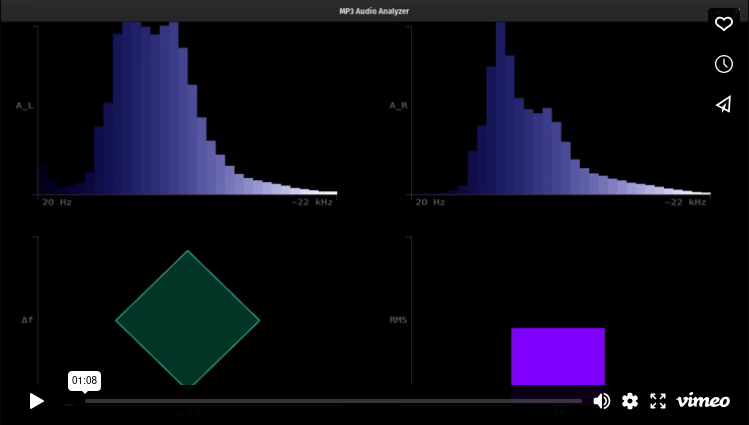
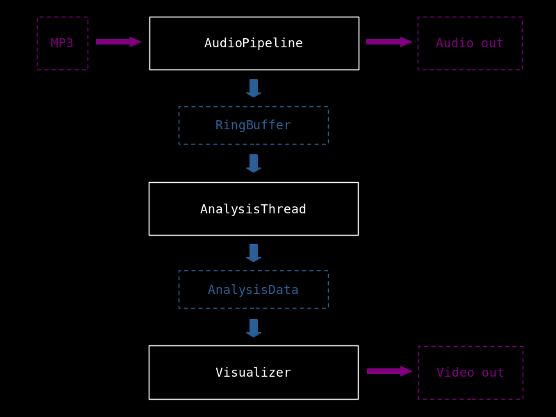

# MP3 Audio Analyzer

**Language:** C++  
**Version:** `v0.4.3`  
**Technologies:** C++17, OpenGL, PortAudio, FFTW, mpg123, GLAD, GLFW

A real-time MP3 audio analyzer with visualization using [mpg123](https://mpg123.de/), [PortAudio](https://portaudio.com/), and [FFTW](https://fftw.org/).  

Plays and analyzes an MP3 file, extracts frequency spectrum and other audio metrics and visualizes the results.  

It's multi-threaded, uses real-time DSP and shows a custom [OpenGL](https://opengl.org/) visualization.

---

## Demo Video

[](https://vimeo.com/1126119128)

A short demo showing the MP3 Audio Analyzer playing back and analyzing an MP3 in real time.  
- The top-left and top-right sections of the screen display the frequency spectra of the left and right audio channels, respectively.  
- The green diamond shape in the bottom-left section represents stereo correlation (X-axis) and frequency bandwidth (Y-axis).  
- The bottom-right section shows the combined volume (RMS) of the left and right channels.

---

## Purpose

This application was created as an exercise in multi-threading, memory management, encapsulation, and C++ programming in general. The goal was to build an app that could:

- Analyze audio in real time
- Deliver analysis results fast enough for real-time visualization

This kind of system has applications in audio software (e.g. DAWs, VST plugins), audio-reactive music videos, and live visual performances. Certain components (such as the ring buffer) are also useful in other real-time, multi-threaded systems.

---

## Features

- Real-time MP3 playback and audio analysis
- Frequency spectrum analysis (L/R channels using FFT)
- Calculates audio metrics: RMS (volume), stereo correlation, bandwidth
- Real-time OpenGL visualization of audio
- Multi-threaded architecture with decoupled decoding, analysis, and rendering

---

## System Overview



> Above diagram shows a simplified version of the system architecture. Classes associated with separate threads are shown in white, I/O is shown in magenta and data sharing between threads is shown in blue.

To prevent audio and visual glitches, the system decouples decoding, playback, analysis, and visualization into separate threads.

The `AudioPipeline` class manages its own thread, which handles MP3 decoding and coordinates with `PortAudio` for playback. (Note: `PortAudio` internally spawns its own thread for audio output.) After decoding, raw PCM audio data is written to a lock-free single-producer, single-consumer (SPSC) ring buffer, ensuring no data races or blocking.

The `AnalysisThread` reads from this ring buffer, performs a Fast Fourier Transform (FFT), and calculates several real-time audio metrics:

- RMS (volume)
- Stereo correlation
- Frequency bandwidth

These metrics are stored in a thread-safe `AnalysisData` structure, which is read by the `Visualizer`.

The `Visualizer`, running on the main thread, accesses this shared data and renders four real-time visualizations using OpenGL.

### Thread Safe Communication

The two key components ensuring safe data sharing between threads in this project are the `RingBuffer` and `AnalysisData`.

`RingBuffer` uses `std::atomic` operations with acquire-release memory ordering to provide a lock-free shared buffer, while preventing data races and torn data.

`AnalysisData` uses `std::mutex` to make sure only one thread at a time can access its data members.

---

## Build Instructions (CMake)

Make sure you have the required development tools:

```bash
sudo apt update
sudo apt install cmake libmpg123-dev portaudio19-dev libfftw3-dev libglfw3-dev libgl1-mesa-dev libglm-dev build-essential
```

Then from the project root:

```bash
mkdir -p build
cd build
cmake ..
cmake --build .
```

This will produce the executable:

```bash
./mp3_analyzer
```

*Note: On some Linux systems, ALSA warnings (or similar messages) may appear at startup. These are expected and caused by the audio backend probing for devices. You can suppress them by redirecting stderr:*

```bash
./mp3_analyzer 2> /dev/null
```

---

## Build Options

By default, the project builds in **Release mode** with optimizations (`-O2`).

To build in **Debug mode** (with debug symbols and no optimizations), use:

```bash
mkdir -p build
cd build
cmake -DCMAKE_BUILD_TYPE=Debug ..
cmake --build .
```

---

## Dependencies

- CMake ≥ 3.10 (build system)  
---
- [FFTW](https://fftw.org/) for the Fast Fourier Transform
- [GLAD](https://gen.glad.sh/) (OpenGL function loader, included in source)
- [GLFW](https://glfw.org/) for window management
- [GLM](https://github.com/g-truc/glm) (header-only math library)
- [libmpg123](https://mpg123.de/) for MP3 decoding
- [PortAudio](https://portaudio.com/) for audio playback
- [stb_image](https://github.com/nothings/stb/blob/master/stb_image.h) (for loading the font texture, included in source)
- [UTF8-CPP](https://github.com/nemtrif/utfcpp/tree/master?tab=BSL-1.0-1-ov-file#readme) (for handling multiple-byte glyphs, included in source)
---
- OpenGL (core graphics API, version 4.1 for macOS compatibility)
- C++17-compatible compiler (e.g., g++, clang++)
- Tested on Linux (Pop!_OS); Windows/macOS support planned

---

## Development Tools
- clang-tidy for static code analysis
- clang-format for consistent formatting

These tools are used during development to help maintain code quality and consistency.

---

## Project Structure

> Below are some highlighted source files that represent key components of the system. See include/ and src/ for the full list.

```
project-root/
│
├── assets/
├── cmake/
├── include/
│   ├── analysis_data.h         # Thread-safe data sharing
│   ├── analysis_thread.h       # Real-time audio analysis
│   ├── audio_pipeline.h        # Decoding and playback thread
│   ├── renderer.h              # OpenGL visual rendering
│   └── ring_buffer.h           # Lock-free ring buffer (SPSC)
├── shaders/
├── src/
│   ├── analysis_data.cpp
│   ├── analysis_thread.cpp
│   ├── audio_pipeline.cpp
│   ├── main.cpp                # Runs Visualizer loop
│   └── renderer.cpp
├── tests/
├── third_party_licenses/
├── CHANGELOG.md
├── CMakeLists.txt
├── LICENSE
├── README.md
├── .clang-format
├── .clang-tidy
└── .gitignore
```

---

## Challenges & Solutions

### Real-Time Thread Communication
**Challenge:**  
Passing audio data from decoder to analyzer without blocking or losing sync.

**Solution:**  
Implemented a lock-free single-producer, single-consumer (SPSC) ring buffer, allowing fast, thread-safe data transfer between AudioPipeline and AnalysisThread.

### Audio/Visual Glitches
**Challenge:**  
Prevent stutters or tearing in both audio playback and visual rendering.

**Solution:**  
Avoided any heavy computation or blocking operations on the audio and main (visual) thread, by offloading analysis entirely.

---

## To Do

- [x] Fix audio glitches
- [x] Investigate buffer underruns or latency issues
- [x] Refactor cleanup logic
- [x] Refactor error handling into reusable functions
- [x] Refactor audio logic into classes
- [x] Add ring buffer
- [x] Add analysis thread
- [x] Add FFTW 
- [x] Add real-time audio analysis
- [x] Add visualizer
- [x] Add CMake support
- [ ] Add cross-platform compatibility (Windows/macOS)

---

## Tests

A basic manual test is included to verify `RingBuffer<T>` functionality (single-producer, single-consumer).

### Running the RingBuffer Test

From root, compile and run with:

```bash
g++ -std=c++17 -pthread \
    -Iinclude \
    tests/ring_buffer_test.cpp \
    -o tests/ring_buffer_test
./tests/ring_buffer_test
```

Expected output:

```bash
Test passed.
```

---

## What I Learned

- Designing thread-safe, real-time systems in C++
- Applying lock-free programming and atomic memory ordering
- Using modern OpenGL for custom visualizations
- Practicing RAII and memory-safe design throughout the codebase
- Integrating third-party libraries (PortAudio, FFTW, mpg123) into a cohesive system

---

## License & Attribution

This code is released under the GPL-2+ License.
See LICENSE file for details.

### Third-party libraries

- **GLAD** — licensed under the [MIT License](https://mit-license.org/)
- **stb_image** — licensed under the [MIT License](https://github.com/nothings/stb/blob/master/stb_image.h)
- **UTF8-CPP** — licensed under the [BSL-1.0 License](https://github.com/nemtrif/utfcpp/tree/master?tab=BSL-1.0-1-ov-file#readme)

The following libraries are not included in this repository, but are dynamically linked at runtime.

- **FFTW** — licensed under the [GPL-2+](https://www.gnu.org/licenses/old-licenses/gpl-2.0.html)
- **GLFW** — licensed under the [zlib/libpng license](https://www.zlib.net/zlib_license.html)
- **GLM** — licensed under the [MIT License](https://mit-license.org/)
- **mpg123** — licensed under the [LGPL 2.1+](https://www.gnu.org/licenses/old-licenses/lgpl-2.1.html)
- **PortAudio** — licensed under the [MIT License](http://www.portaudio.com/license.html)

You are responsible for complying with their licenses if you reuse or redistribute this project.

### Font

DejaVu Sans Mono (edited)
- Source: https://dejavu-fonts.github.io/
- License: Bitstream Vera Font License (with modifications)
- Used only to generate a static bitmap font atlas (font_atlas.png)

### Audio Source

This project uses a music excerpt from the track:

**"Orbiting A Distant Planet" by Quantum Jazz**
- Original source: [Free Music Archive](https://freemusicarchive.org/music/Quantum_Jazz/End_of_Line/07_-_Quantum_Jazz_-_Orbiting_A_Distant_Planet/)
- License: [CC BY-SA 3.0](https://creativecommons.org/licenses/by-sa/3.0/)
- Changes made: The original track was excerpted (first ~1 minute), volume was adjusted, limiting was applied, silence was added at the beginning and a fade-out was added.
- This adapted version is also licensed under [CC BY-SA 3.0](https://creativecommons.org/licenses/by-sa/3.0/).
